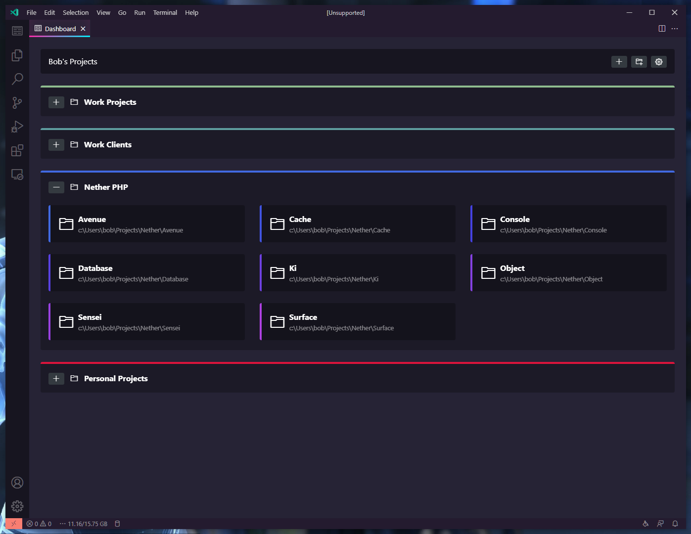

# Easy Dashboard

Tableau de bord pour lancer rapidement vos projets dans VS Code ou Cursor. Regroupez vos dossiers locaux, connexions SSH et autres workspaces en un seul endroit.

---

## Installation

Installez l’extension depuis le marché d’extensions (VS Code, Cursor, etc.). Recherchez **Easy Dashboard**.

Une fois installée, une icône **Projects** apparaît dans la barre d’activité (à gauche). En ouvrant une fenêtre sans workspace, la vue Projets peut s’afficher automatiquement.

---

## Démarrer

- **Vue Projets (sidebar)**  
  Cliquez sur l’icône Projects dans la barre latérale pour voir la liste de vos projets et dossiers, les derniers ouverts, et les actions (ajouter, trier, etc.).

- **Dashboard plein écran**  
  Ouvrez le dashboard en grand via la barre d’outils de la vue Projets (bouton dédié) pour une grille de projets avec dossiers, couleurs et icônes.

---

## Ajouter des projets

- **Dossier local** : choisir un dossier sur votre machine.
- **SSH** : indiquer utilisateur, hôte et chemin (nécessite l’extension Remote - SSH).
- **URI** : coller une URI complète (ex. `vscode-remote://...`) pour d’autres types de connexion.

Vous pouvez ajouter un projet à la racine ou dans un dossier existant (clic droit sur un dossier ou bouton dans la sidebar).

---

## Dossiers et organisation

- Créez des **dossiers** pour regrouper vos projets.
- **Glisser-déposer** : réorganisez les projets et dossiers dans la sidebar et dans le dashboard plein écran.
- **Tri** : par nom, date de création ou dernière ouverture (menu de la vue Projets).

---

## Personnalisation

- **Projet** : description, icône, couleur (via le menu contextuel ou les paramètres du projet dans le dashboard).
- **Dossier** : couleur, et options pour appliquer une couleur ou une palette aux projets du dossier.
- **Dashboard** : titre, taille du texte, disposition des colonnes, coins arrondis, affichage des chemins, ouverture dans une nouvelle fenêtre, etc. (paramètres du dashboard depuis le plein écran).

---

## Paramètres et synchronisation

Les projets et réglages sont stockés dans la configuration utilisateur de VS Code/Cursor. Si la **synchronisation des paramètres** est activée, votre dashboard est répliqué sur vos autres appareils.

Pour ne pas synchroniser la liste des projets, désactivez la synchronisation pour le paramètre **Easy Dashboard: Database** dans les réglages.

---

## Raccourcis utiles

| Action              | Où                                      |
|---------------------|------------------------------------------|
| Ajouter un projet   | Bouton + ou clic droit sur un dossier   |
| Nouveau dossier     | Bouton dossier dans la barre de la vue  |
| Ouvrir un projet    | Clic sur le projet (ou menu : ouvrir ici / nouvelle fenêtre) |
| Modifier / supprimer| Clic droit sur le projet ou le dossier  |

---

*Easy Dashboard fonctionne avec VS Code et les éditeurs compatibles (Cursor, etc.). Les projets distants (SSH) ne nécessitent pas d’installer l’extension sur la machine distante.*
